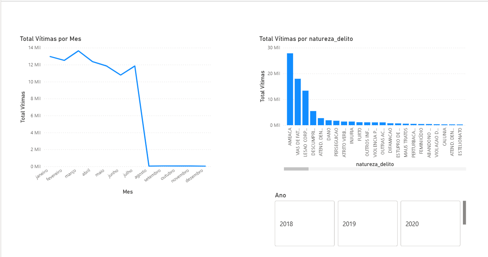

# 🔵 Dashboard de Segurança Pública — Violência Doméstica em Minas Gerais

Dashboard analítico desenvolvido no **Power BI** com foco em violência doméstica no estado de Minas Gerais, comparando os anos de **2018 e 2023**. Os dados são públicos, extraídos diretamente do portal do governo de MG, e passaram por um pipeline de engenharia de dados construído em Python antes de chegar ao visual.

---

## 🗂️ Estrutura do Projeto

```
📦 projeto
 ┣ � etl_pipeline/
 ┃ ┣ 📄 etl_pipeline.py                  # Conceito base de ETL (Extrair, Transformar, Carregar)
 ┃ ┣ 📄 consumindo_dados_governo.py      # Exploração e diagnóstico dos CSVs brutos do governo
 ┃ ┣ 📄 construindo_camada_silver.py     # Limpeza, padronização e união dos dados (Camada Silver)
 ┃ ┣ 📄 construindo_camada_gold.py       # Agregações analíticas e rankings (Camada Gold)
 ┃ ┣ 📄 transformando_em_tabela.py       # Conversão de JSON para DataFrame e Parquet
 ┃ ┗ 📄 consultando_com_sql.py           # Consultas SQL via DuckDB em arquivos Parquet
 ┣ 📁 dashboard/
 ┃ ┗ 📄 BH.pbix                          # Arquivo do Power BI Desktop
 ┣ 📁 docs/                              # Documentação adicional e imagens do dashboard
 ┣ 📄 minas_gerais_2018.csv              # Dados brutos — Feminicídio (2018)
 ┣ 📄 minas_gerais_2023.csv              # Dados brutos — Violência doméstica (2023)
 ┣ 📄 violencia_mg_silver.parquet        # Tabela fato unificada e limpa (Camada Silver)
 ┣ 📄 gold_ranking_geral_municipios.csv  # Top 10 municípios por volume geral (Camada Gold)
 ┣ 📄 gold_ranking_maria_da_penha.csv    # Top 10 municípios por descumprimento de medida protetiva
 ┣ 📄 dados_finais.parquet               # Parquet de exemplo gerado no pipeline didático
 ┗ 📄 README.md
```

---

## 🛠️ Tecnologias Utilizadas

| Ferramenta | Uso |
|---|---|
| Python 3 | Orquestração do pipeline ETL |
| Pandas | Leitura, limpeza e transformação dos CSVs |
| DuckDB | Consultas SQL analíticas em arquivos Parquet |
| Apache Parquet | Formato de armazenamento colunar da camada Silver/Gold |
| Power BI Desktop | Modelagem semântica, DAX e visualização |

---

## ⚙️ Pipeline de Dados (Arquitetura Medallion)

O projeto segue a arquitetura **Bronze → Silver → Gold**, comum em projetos de Engenharia de Dados modernos.

```
[CSVs Brutos do Governo]  ← Bronze
        ↓
[construindo_camada_silver.py]
  • Leitura com encoding correto (latin-1 / utf-8)
  • Padronização de colunas
  • União dos anos 2018 e 2023
  • Exportação para Parquet          ← Silver (violencia_mg_silver.parquet)
        ↓
[construindo_camada_gold.py]
  • Queries SQL via DuckDB
  • Ranking geral por município
  • Ranking de descumprimento de medidas protetivas
  • Exportação para CSV              ← Gold (pronto para o Power BI)
```

---

## 📐 Métricas Calculadas (DAX)

As medidas abaixo foram criadas no Power BI Desktop utilizando a linguagem DAX e compõem a camada de agregação do modelo semântico.

### Total Vítimas

Medida base do modelo. Realiza a soma simples da coluna `qtde_vitimas` da tabela fato `violencia_mg_silver`, servindo como fundação para todos os visuais e filtros do dashboard.

```dax
Total Vítimas = SUM(violencia_mg_silver[qtde_vitimas])
```

---

## �️ Preview do Dashboard



---

## �📈 Principais Insights Extraídos

### Sazonalidade dos Crimes: Queda Abrupta a Partir de Agosto

O gráfico de linhas de **Total Vítimas por Mês** revela um padrão de alta sustentada no primeiro semestre. O volume se mantém elevado entre janeiro e julho, oscilando entre **12 mil e 14 mil vítimas mensais**, com pico em **março (~13.608)**. A partir de agosto, há uma **queda abrupta para próximo de zero** — comportamento que reflete a cobertura do dataset, cujos registros de 2023 se encerram em julho. Essa característica é importante para a leitura correta do visual e deve ser considerada em análises comparativas entre períodos.

### Tipologia dos Crimes: Ameaça Domina o Cenário

O gráfico de barras por `natureza_delito` expõe uma hierarquia clara de violência. **Ameaça lidera isolada com ~27.861 vítimas** — um volume 55% superior ao segundo colocado. Na sequência, **Vias de Fato / Agressão soma 17.992** e **Lesão Corporal registra 13.374**. Juntos, esses três tipos de crime concentram mais de **68% de todo o volume de ocorrências** do período, indicando que a violência física e psicológica direta são os vetores predominantes da violência doméstica em Minas Gerais.

### Descumprimento de Medidas Protetivas: Um Alerta Estrutural

Com **5.479 registros de Descumprimento de Medida Protetiva de Urgência**, o dado revela uma falha sistêmica na proteção das vítimas que já acionaram o sistema judicial. Belo Horizonte concentra **1.194 desses casos** — mais que o dobro de Contagem (198) e Juiz de Fora (114), as cidades seguintes no ranking. Esse indicador vai além da estatística criminal: ele mede a efetividade do Estado em garantir a segurança de mulheres que já estão sob proteção legal, e aponta para a necessidade de monitoramento ativo e integração entre os sistemas de justiça e segurança pública.

---

## 🏙️ Top 10 Municípios — Volume Geral de Vítimas (2023)

| # | Município | Região | Total de Vítimas |
|---|---|---|---|
| 1 | Belo Horizonte | Capital | 10.879 |
| 2 | Juiz de Fora | Interior de MG | 2.732 |
| 3 | Contagem | RMBH | 2.407 |
| 4 | Uberlândia | Interior de MG | 2.273 |
| 5 | Montes Claros | Interior de MG | 1.786 |
| 6 | Betim | RMBH | 1.564 |
| 7 | Uberaba | Interior de MG | 1.533 |
| 8 | Ribeirão das Neves | RMBH | 1.526 |
| 9 | Governador Valadares | Interior de MG | 1.315 |
| 10 | Santa Luzia | RMBH | 1.231 |

---

## 📂 Fonte dos Dados

Os dados são públicos e disponibilizados pela **Secretaria de Estado de Justiça e Segurança Pública de Minas Gerais (SEJUSP-MG)** através do portal de dados abertos do governo estadual.

---

## 👩‍💻 Autora

Desenvolvido por **Andrea** como projeto de portfólio em Engenharia e Análise de Dados.
